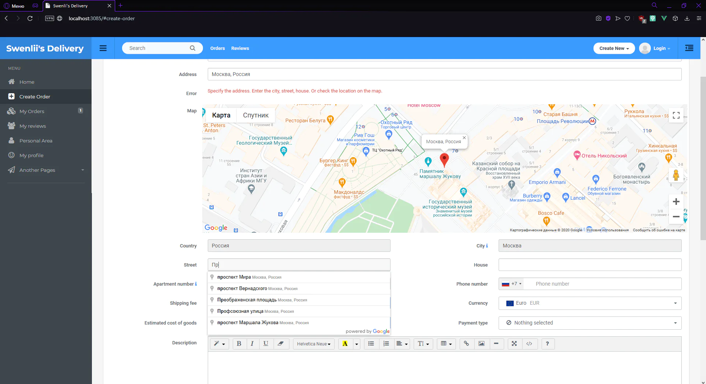

# Swenlii's delivery

🚛 сайт доставки продуктов на дом

 

> ⚠️ **ВНИМАНИЕ!** ⚠️ Не скачивайте проект. Только для чтения. 

## ⚡Описание проекта

**Год разработки**: 2020 год

**Стек**: ● Vue.js ● ejs ● google map api ● HTML ● CSS ● Bootstrap ● socket.io ● Node.js ● Express

Лёгкое и простое приложение, позволяющее стать курьером за 2 минуты и получать быстрый доход или стать клиентом и заказывать доставку на дом чего угодно (от посылки с почты до продуктов и косметики). Создано при помощи чистого Vue.js на сервере express/node.js, в стиле используется bootstrap и чистый css.

## 💡 Идея проекта

На сайте можно зарегистрироваться как доставщик или клиент.  Доставщики указывают свой адрес и плату за доставку, после чего ожидают нового заказа. Клиент же, после регистрации, добавляет свой заказ. Заказ может содержать что угодно: продукты, косметику, цветы, обои, заказ кофе или забор посылок. Такой свободный формат заказов является очень удобным для инвалидов и старых людей. При добавлении приходит уведомление всем близлежащим доставщикам о поступлении нового заказа. Доставщик отмечает заказ как взятый. После доставки пользователь отмечает заказ как выполненный и часть денег уходит доставщику. 

Данный сайт разрабатывался почти 2 месяца. Здесь я впервые столкнулась с PayPal. Самым сложным для меня была разработка карты и геолокации. В том числе автокомплит адреса через множество инпутов (довольно сложная схема) и вычисление ближайших доставщиков.

## Требования

- npm v6.14.4
- node v13.12.0
- Проект запускался на windows с использованием программы webstorm

## Установка

Если вы все же решили установить проект, будьте готовы к ошибкам:
- Проект был создан на старой версии npm, при `npm install` могут возникнуть конфликты. 
- Для полноценной работы сайту требуется api код google map, а так же api код payPal и пароль для доступа к mail сервису для отправки писем.
- Проект зависим от БД, в том числе заказы на главной не покажутся

### Инструкция:

1. `npm install`
2. `node app.js`

## TODO
- [ ] Обновить проект, чтобы он запускался
- [ ] Добавить заглушки для зависящих от БД
- [ ] Проверить сайт на ошибки
